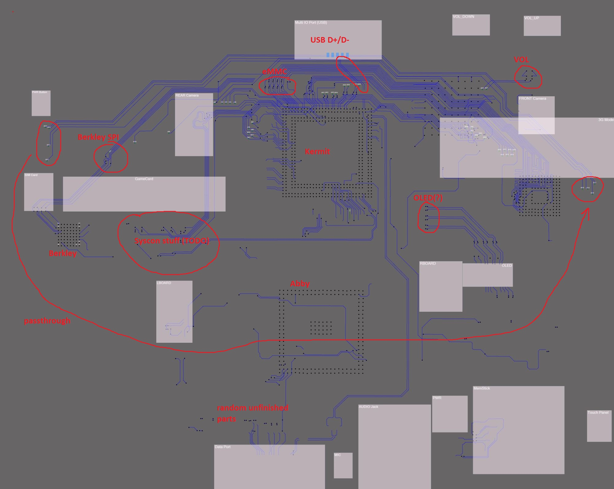
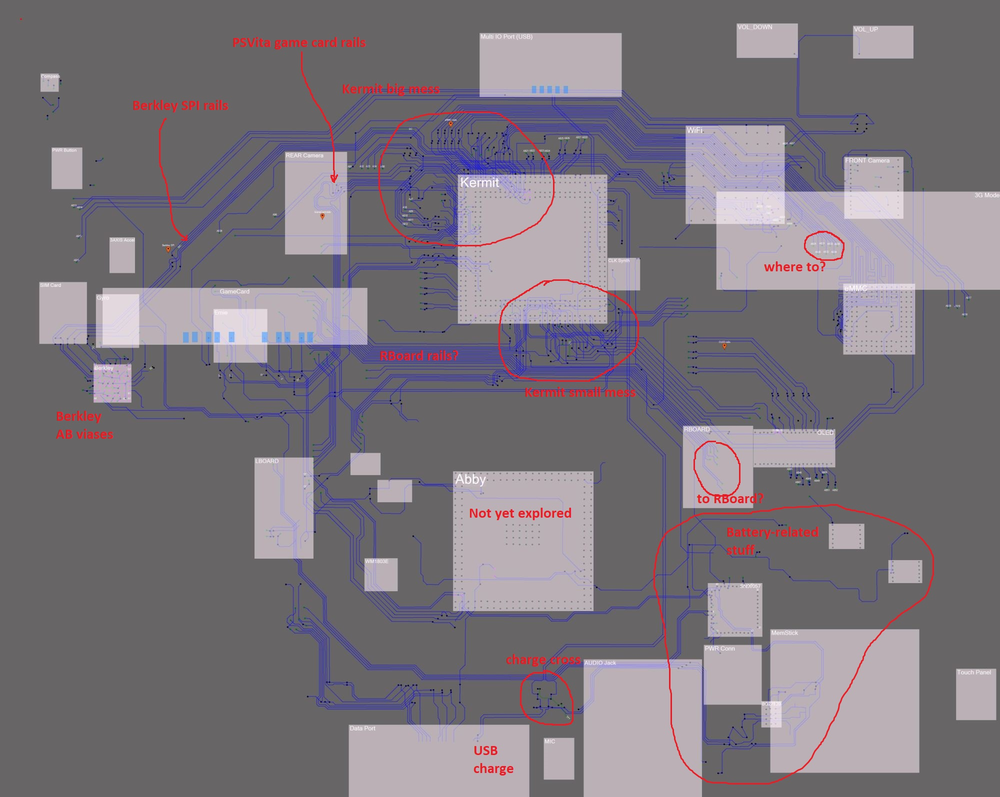

# Заметки по реверсу материнской платы PSVita PCH-1001

Плата состоит из 10 слоев. Причем сторону A (лицевая) и B (задняя) я тоже считаю за слои, т.к. то что частично было содрано при делейринге материнской платы - видно на нетронутых сторонах.

Где-то на 6-7 слое находится плотная середина, где обе стороны соединяются особенно жирными виасами. Я их называю "AB"-виасы (то есть виасы для соединения сторон A и B).
Их можно считать реперными точками во время реверса.

Исследование проводилось в два присеста:
- Первая фаза, я попытался отдельно отреверсить сторону A и B, до реперных AB-виасов. Затея такая себе, потому что траверсить потом было нереально
- Вторая фаза, я добавил в утилиту Deroute поддержку слоев (спец. сущность - Layer). Теперь можно комфортно лазить в пределах одного слоя, скрывая ненужные векторизованные слои по отдельности.

Чипы PSVita называются кодовыми словами по имени персонажей телесериала "Улица Сезам".

## Сторона A

На лицевой стороне находится самый жирный чип - SoC Kermit. Под ним находится МС управления и мониторинга за питанием (Abby) (в полукерамическом коатинге). В левом углу находится небольшая микросхема - Berkley, которая 
является микроконтроллером для Motion-подсистемы PSVita (управляет компасом, гироскопом и акселерометром). На Berkley тут рядом есть отдельное исследование (VitaMotion).

В правой части находится eMMC с заводской и рабочей прошивкой (и всякое ещё там есть).

В правом нижнем углу находится пока непонятная упряжка мелких чипов, скорее всего - это контроллер заряда аккумулятора. Эта область ещё мало исследована.

Чуть выше и правее Kermit находится микросборка (микросхема на пришлепанной мини-PCB) с чипом для WiFi/Bluetooth.

## Сторона B

Основной чип на задней стороне - это Ernie (Syscon). Его разводка особенно упоротая и вся работа собственно в основном сосредоточена вокруг распутывания лапши рядом с ним.

Также на задней стороне есть чип для аудио (такой красивый зеркальный), Wolfson. Пока не очень исследованы его соединения.

## Прочее

Мелкие провода, которые в итоге упираются в Power/Ground отмечены как "DC" (просто я их вёл, но потом они оказываются уткнулись в Power/Ground).
Вообще целью исследования не является анализ Power Wells, больше интересно соединение сигналами.

AB-виасы пронумерованы в рандомном порядке (`AB52` сейчас последний номер, это для себя чтобы не забыть) и имеют зеленый цвет (используется сущность ViasInout утилиты Deroute).

Маркировка контактов МС общепринятая - BGA-шная. Если смотреть на чип со стороны контактов (снизу), то когда ключ слева-внизу - вправо идёт нумерация 1, 2, 3..., вверх идёт буквенное
обозначение A, B, C ... (I и O пропускаются). Когда буквы кончаются - начинаются AA, AB, AC итд.

Исходные картинки слоев не всегда точно выровнены, поэтому трассировку приходится немного "подгонять", это не страшно.

## Прогресс

### 30072021

Так как что там было в первой фазе я уже не помню, а сейчас это выглядит как месиво проводов, решил немного фиксировать прогресс по второй фазе, чтобы потом можно было освежить память.

- Добавил все разъемы
- Хорошо потраверсил только LAYER 07 (но там "3 волосинки")
- Самый жирный оказался LAYER 08
- Большая часть стороны "A" готова, нужно подрихтовать LAYER 08 и проверить траверс, чтобы не было сцепки проводов. Также нужно расставить ICs.
- После завершения работ по стороне "A" также нужно составить сводную таблиц AB-виасов, чтобы понимать что куда идёт.

### 09082021

Почти доделал сторону "A", осталось разобраться со "слипшимися" проводами и дать названия для остатков AB-виасов.

Я решил известные AB-виасы называть уже нормальными названиями, типа "AB_OLED1", а также дать название `ABBA` для виасов которые выходят со стороны A, проходят транзитным проводом по стороне B и потом уходят опять на сторону A.

Из микрохсем остались неидентифицированы 3 штуки:
- На стороне B рядом c Wolfson Audio DAC
- На стороне A две штуки, рядом с контроллером заряда батареи SN99057.

Кстати там рядом ещё есть микросхема слежения за зарядом батареи BQ27520, которая также используется в телефонах SONY Ericsson (LT15i, LT18i, MK16, MT11i Xperia neo V, MT15i Xperia Neo, ST15, ST17i, WT19).

Пока очень непонятная ситуация складывается по части Power Management. В особенности роль микросхемы, которая обозначена как `Abby` (та что в керамическом корпусе). На HENkaku вики написано что она аналоговая, но 
я вижу что она похоже соединяется интерфейсом типа I2C/SPI с остальными частями. Будет понятнее после разбора стороны B.
