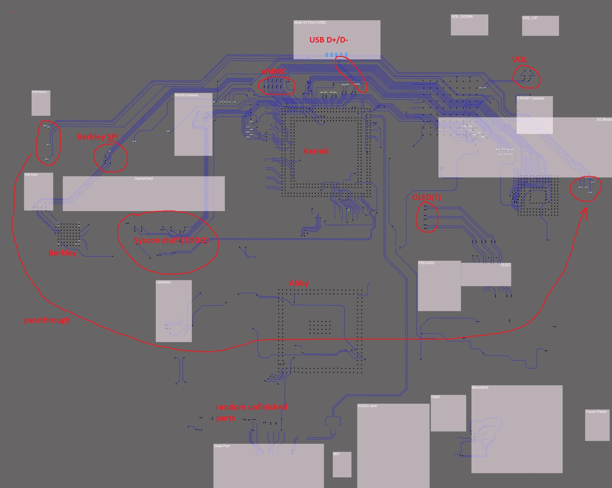
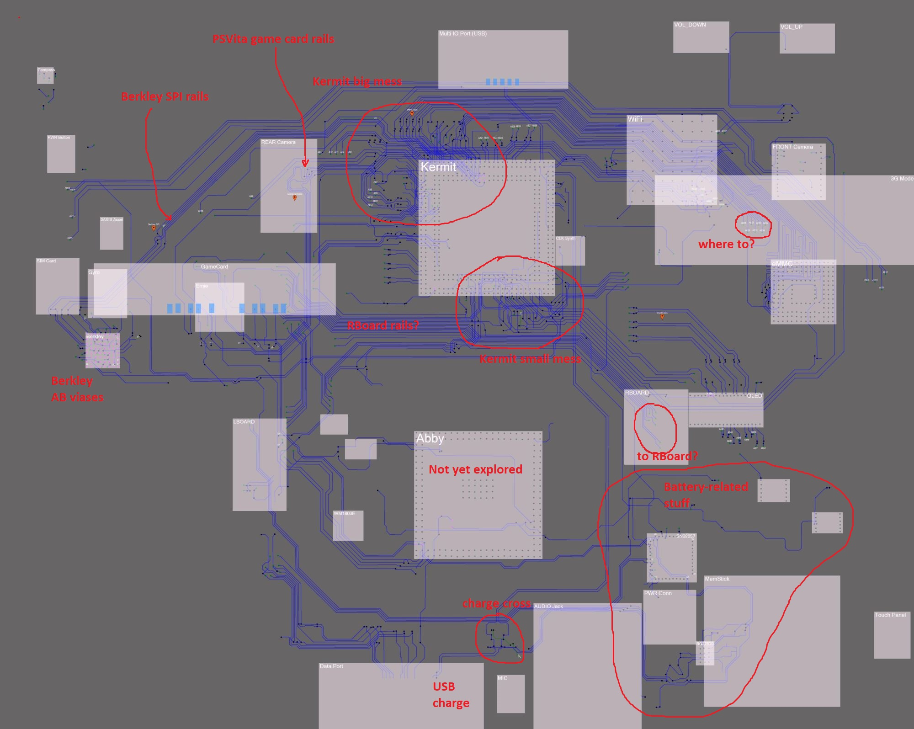

# Notes on the PSVita PCH-1001 motherboard reverse

The board consists of 10 layers. And I count side A (front) and B (back) as layers too, because what was partially peeled off when the motherboard was de-layered is visible on the untouched sides.

Somewhere on layer 6-7 is the tight middle, where both sides are joined by particularly fat vias. I call them "AB"-vias (that is, vias to connect sides A and B).
They can be considered as reference points during the reverse.

The study was conducted in two phases:
- Phase one, I tried to reverse the A and B sides separately, up to the AB-vias reference points. It was not a good idea, because it was not realistic to reverse it afterwards.
- The second phase, I added to the Deroute utility support for layers (special entity - Layer). Now you can comfortably navigate within one layer, hiding unnecessary vectorized layers separately.

PSVita chips are codenamed after Sesame Street characters.

## Side A

On the front side is the fattest chip, the Kermit SoC. Underneath it is the MCU for power control and monitoring (Abby) (in a semiceramic coating). In the left corner is a small chip, the Berkley, which 
is the microcontroller for the Motion subsystem of the PSVita (controls the compass, gyroscope and accelerometer). Berkley has a separate study (see `VitaMotion`).

On the right side is the eMMC with the factory and working firmware (and stuff else there).

In the lower right corner there is still an obscure bunch of small chips, most likely a battery charge controller. This area hasn't been explored much yet.

Just above and to the right of the Kermit is a micro-assembly (a chip on a docked mini-PCB) with a chip for WiFi/Bluetooth.

## Side B

The main chip on the back side is Ernie (Syscon). Its wiring is especially geeky and all the work is actually mostly concentrated around untangling the noodles next to it.

Also on the back side is the audio chip (such a nice mirrored one), Wolfson. Not really explored its connections yet.

## Other.

The small wires that end up going into Power/Ground are marked as "DC" (I just led them in, but then they end up going into Power/Ground).
Generally the purpose of the study is not to analyze the Power Wells, more interested in the signal connections.

AB-vias are numbered randomly (`AB52` is the last number now, it's for myself not to forget) and are green (using the ViasInout entity of the Deroute utility).

The pin marking of the IC pins is common - BGA. If you look at the chip from the pin side (bottom), when the key is left-bottom, the numbering 1, 2, 3... goes to the right, up goes the letter
A, B, C... (I and O are skipped). When you run out of letters, you start AA, AB, AC, etc..

The source images of layers are not always precisely aligned, so the tracing has to be slightly "adjusted", it's not a problem.

## Progress

### 30072021

Since I don't remember what was there in the first phase anymore, and now it looks like a mess of wires, I decided to record a little progress on the second phase, so I can refresh my memory later.

- Added all the connectors.
- Only LAYER 07 is good (but it has "3 hairs").
- LAYER 08 is the fattest.
- Most of the "A" side is done, need to trim the LAYER 08 and check the traverse to make sure there is no wire hitch. The ICs also need to be spaced out.
- When the "A" side is finished, you also need to make a summary of the AB-vias to understand what goes where.

### 09082021

Almost finished the A-side, the only thing left is to deal with the "sticky" wires and give names to the rest of the AB vias.

I decided to call the known AB-vias with proper names, like "AB_OLED1", and also to name `ABBA` for the vias that come out of side A, pass a transit wire through side B and then go back to side A.

There are 3 chips left unidentified:
- On side B next to the Wolfson Audio DAC.
- On side A, two ICs, next to the SN99057 battery charge controller.

By the way there is also a battery fuel gauge tracking chip BQ27520 which is also used in SONY Ericsson phones (LT15i, LT18i, MK16, MT11i Xperia neo V, MT15i Xperia Neo, ST15, ST17i, WT19).

So far the situation is very unclear in terms of Power Management. Especially the role of the chip, which is designated as `Abby` (the one in a ceramic case). On the HENkaku wiki it says it's analog, but 
I see that it seems to be connected via an I2C/SPI type interface to the rest of the circuit. It will be clearer after taking apart the B side.
