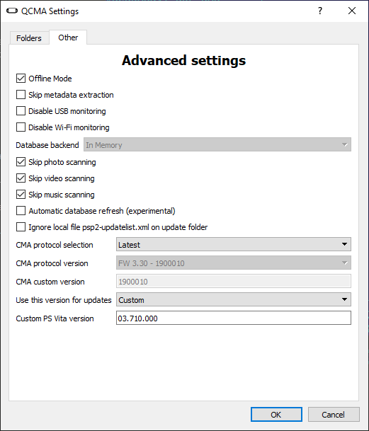

# Vita Unbrick Guide

## Introduction

This section contains information for those who tried to do what is written in https://vita.hacks.guide/, but because of their crooked hands somehow managed to brick the Vita in the process.

Generally speaking, it is quite difficult to brick a Vita. There is factory firmware inside the eMMC and it's hard to fuck it up in any other way.
Anything bad that usually happens during experiments with Vita firmware is called "Soft Brick", i.e. "software brick".

This guide is intended specifically for the Soft Brick. If you are a Team Molecule hacker and managed to brick the eMMC, this guide is not for you. In your case, you can be added to the "Hall of Shame" https://playstationdev.wiki/psvitadevwiki/index.php?title=Wall_of_Shame 

## Technical details of the firmware upgrade

During the update process Vita requests a special XML file from Content Manager, psp2-updatelist.xml, which has about the following content:

```
<?xml version="1.0" encoding="UTF-8"?>
<update_data_list>
<region id="us">
<np level0_system_version="01.600.000" level1_system_version="03.700.000" level2_system_version="03.700.000" map="03.700.000" />
<np_d level0_system_version="01.600.000" level1_system_version="03.700.000" level2_system_version="03.700.000" map="03.700.000" />
<version system_version="03.700.000" label="3.70">
<update_data update_type="full">
<image size="133770752">http://dus01.psp2.update.playstation.net/update/psp2/image/2019_0109/rel_54227fd645fcb6f177102cbd1f2d1924/PSP2UPDAT.PUP?dest=us</image>
</update_data>
</version>
<recovery spkg_type="systemdata">
<image spkg_version="01.000.010" size="56768512">http://dus01.psp2.update.playstation.net/update/psp2/image/2019_0109/sd_28b537fa2508afc523038030fd3d624f/PSP2UPDAT.PUP?dest=us</image>
</recovery>
<recovery spkg_type="preinst">
<image spkg_version="01.000.000" size="128788480">http://dus01.psp2.update.playstation.net/update/psp2/image/2019_0109/pre_af18f72827180188a00ec63196e31c4b/PSP2UPDAT.PUP?dest=us</image>
</recovery>
</region>
</update_data_list>
```

The basic entities you will need:
- region id: Indicates the region for which the firmware is applied
- level0_system_version and similar: contains firmware versions, it is better not to change them
- label: firmware name which will be shown on the screen during update
- update_type="full": Contains the URL for the PUP firmware that is applied during a normal update (from Settings or in other cases where the Vita is in working mode). This method is not suitable for this guide.
- recovery: Contains URLs for firmware which is installed in Recovery mode. It is these firmwares which we will use for the software unbrick in Recovery Menu

## Errors

Before the unbrick process, a few words about errors that may occur during the unbrick. If you do everything correctly, there shouldn't be any errors.

Here are the most common errors:
- C3-10698-4: The region language (region id) does not match your PS Vita region.
- C3-12027-2 at 7%: Happens when you try to flash with update_type="full" firmware in Recovery mode.

## Content Manager Assistant and Qcma

SONY's native application for flashing PS Vita via PC is called Content Manager Assistant. In order to communicate with it, you need to connect your PS Vita via USB to your PC and then they will start exchanging data.
This program does not suit us as it does not have the ability to regulate processes.

For unbrick we need Qcma: https://codestation.github.io/qcma/

Qcma allows you to control the flashing process.

## Go to the Recovery Menu

If your PS Vita bricks, it should automatically go into Recovery mode.

If you need to force boot into Recovery mode, you need to press PS Button + Right Shift at the same time when you turn on your PS Vita.

When PS Vita is bricked, all items except `5. Update System Software` will not be available. Unbrick requires you to use item 5 and update with a PC (`Connecting to a PC`).

https://www.xtremepsvita.com/2012/07/17/activating-the-ps-vitas-safe-mode-recovery-menu/

## Setting up Qcma

The Qcma settings should be as follows:



A few comments:
- Offline mode: This setting is required for Qcma not to go to SONY servers to download firmware (PUP), but to take it from the folder `C:\\Users\User\Documents\PSV Updates` (or where you specified this folder in the Qcma settings).
- Ignore local file psp2-updatelist: This option must be disabled in order for Qcma to transfer PS Vita file psp2-updatelist from the `PSV Updates` folder
- Use this version for updates: Custom + 03.710.000. You need to specify the version of the firmware to restore that you will be using. Specified version must correspond to what is written in psp2-updatelist.

Qcma settings need to be done once and then close the graphical version of the application.

To control the process it is recommended to use the console version of Qcma (qcma_console.exe) with the Verbose option:

```
cd %PROGRAMFILES%\Qcma
qcma_console.exe --verbose
```

## Downloading and preparing PUPs

Now you need to download all the necessary PUPs, for the firmware version you specified in the Qcma settings.

The problem with the PUPs is that they all have the same name: `PSP2UPDAT.PUP`.

In Offline mode, Qcma truncates the URL like `http://dru01.psp2.update.playstation.net/update/psp2/image/2019_0625/rel_46b79772448291194608b44b17235da2/PSP2UPDAT.PUP?dest=ru` to `PSP2UPDAT.PUP` and passes this file to PS Vita.

Since flashing from Recovery Menu requires two PUP files: `systemdata` and `preinst`, after downloading these PUP in the folder `PSV Updates` rename them as `PSP2UPDAT-SYS.PUP` and `PSP2UPDAT-PRE.PUP`.

## Preparing the psp2-updatelist

In the original psp2-updatelist you need to change the systemdata and preinst firmware names so that Qcma transfers the correct files to the PS Vita.

Example of corrected psp2-updatelist.xml:

```
<recovery spkg_type="systemdata">
<image spkg_version="01.000.010" size="56768512">http://dru01.psp2.update.playstation.net/update/psp2/image/2019_0625/sd_24f9c20052b3ff8b1b1f62da290c11c1/PSP2UPDAT-SYS.PUP?dest=ru</image>
</recovery>
<recovery spkg_type="preinst">
<image spkg_version="01.000.000" size="128788480">http://dru01.psp2.update.playstation.net/update/psp2/image/2019_0625/pre_2efd6510bff08dd33b186c422789b200/PSP2UPDAT-PRE.PUP?dest=ru</image>
</recovery>
```

## Flashing from Recovery Menu

Now you need to connect PS Vita, run qcma_console and choose in Recovery Menu to update via PC.

Recovery Menu will first request psp2-updatelist.xml, which Qcma will send from the `PSV Updates` folder.

Then Recovery Menu will sequentially request `systemdata` and `preinst`, at the URLs that are specified in psp2-updatelist.xml. Since Qcma works Offline, it will trim the URL data and send the required PUP files from the `PSV Updates` folder.

When the percentage reaches 100%, your PS Vita will restart and will unbrick.

## If the PS Vita restarts after flashing but the screen is black

Try pulling out the 3G module (if you have the 3G version of your PS Vita). In some cases, a faulty 3G module prevents you from booting normally.


Translated with www.DeepL.com/Translator (free version)
